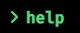
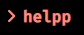
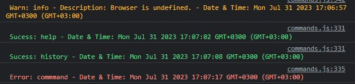
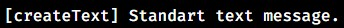
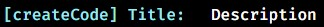
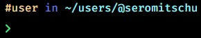

<h1>Seromitschu Terminal Portfolio</h1>


> - This website made by **Seromitschu**. <br>
> - Click to see the current trial site. <a href="https://seromitschu.vercel.app">Live Demo<a>


<h1>Build With</h1>

**This project was built using these technologies.**
<br><br>

> - JavaScript
> - HTML
> - CSS <br> **Languages ​​were used while making this website.**
> - Vercel <br>**Deploying service.**
> - Visual Studio Code <br>**Code Editor**
> - Font Awesome <br> **Icons**


<h1>Getting Started</h1>

> - Download project and open in your code editor.
> - Run ``index.html``.

**Now you can customize and use the website according to you!**

> - If you want, you can activate your website using vercel.

<h1>Customize</h1>

**Below I will tell you some things so that you do not have any difficulties while customizing your website.**

<h2>Commands</h2>

_**Command Template:**_

> - The current scheme of commands is as follows.
```javascript
if(value === "Command Usage"){
    //// Maintenance Mod
    if(config.seromitschu.system.mods.maintenance === true){
        return;
    }
    trueValue(value);
    consoleSucess(value);
    createText("Text Reply");
    createCode("Text Title", "Text Description");
    //// Command History
    saveHistory(document.querySelector("input").value.trim().toLowerCase());
}

  //// Command Not Found
  else{
    if(config.seromitschu.system.mods.maintenance === true){
      return;
    }
    falseValue(value);
    consoleError(value);
    createText(`<i class="fa-solid fa-square-xmark error"></i> "<span class="error">${value}</span>" ${config.seromitschu.commands.commandNotFound}`);
    //// Command History
    saveHistory(document.querySelector("input").value + `&nbsp; <i class="fa-solid fa-square-xmark error"></i>`.trim().toLowerCase());
  }
}
```

_**True & False Value:**_

> - This feature allows the command entered by the visitor to be painted in the color with the valid meaning while it is running, and change it to the color with the invalid meaning when it is not running.
```javascript
function trueValue(value){
  const div = document.createElement("section");
  div.setAttribute("class", "type2");
  const i = document.createElement("i");
  i.setAttribute("class", "fas fa-angle-right icone");
  const mensagem = document.createElement("h2");
  mensagem.setAttribute("class", "sucess");
  mensagem.textContent = `${value}`;
  div.appendChild(i);
  div.appendChild(mensagem);
  app.appendChild(div);
}

function falseValue(value){
  const div = document.createElement("section");
  div.setAttribute("class", "type2");
  const i = document.createElement("i");
  i.setAttribute("class", "fas fa-angle-right icone error");
  const mensagem = document.createElement("h2");
  mensagem.setAttribute("class", "error")
  mensagem.textContent = `${value}`;
  div.appendChild(i);
  div.appendChild(mensagem);
  app.appendChild(div);
}
```
<div style="float: left;">

> - **True Value:**<br>


> - **False Value:**<br>


_**Console Sucess, Warn, Error:**_

> - It allows you to monitor command statuses from the console in a simple way.
```javascript
function consoleSucess(value){
  console.log(`%c Sucess: ${value} - Date & Time: ${Date()}`, `color: #5AD786`);
}

function consoleError(value){
  console.log(`%c Error: ${value} - Date & Time: ${Date()}`, `color: #F78F85`);
}

function consoleWarn(value){
  console.log(`%c Warn: ${value} - Date & Time: ${Date()}`, `color: #FABD2F`);
}
```
> - Console:<br>


_**Create Text and Create Code:**_

> - Styles of response to the command typed by the visitor.
```javascript
function createText(text, classname){
  const p = document.createElement("p");
  p.innerHTML = text;
  app.appendChild(p);
}

function createCode(code, text){
  const p = document.createElement("p");
  p.setAttribute("class", "code");
  p.innerHTML = `${code}: <span class='text'> ${text} </span>`;
  app.appendChild(p);
}
```

> - **Create Text:**<br>


> - **Create Code:**<br>


_**Open Terminal:**_

> - Texts that will be reflected on the screen when the terminal is opened.

```javascript
async function openTerminal(){
  createText(config.seromitschu.welcome.first);
  await delay(config.seromitschu.delays.welcome.first);
  createText(config.seromitschu.welcome.second);
  await delay(config.seromitschu.delays.welcome.second);
  createText(config.seromitschu.welcome.commands);
  newLine();
}
```
> - **Open Terminal:**<br>


_**New Line:**_

> - Simple new line.

```javascript
function newLine(){
  const p = document.createElement("p");
  const span1 = document.createElement("span");
  const span2 = document.createElement("span");
  p.setAttribute("class", "path");
  p.textContent = config.seromitschu.path.who;
  span1.textContent = config.seromitschu.path.preposition;
  span2.textContent = config.seromitschu.path.file;
  p.appendChild(span1);
  p.appendChild(span2);
  app.appendChild(p);
  const div = document.createElement("div");
  div.setAttribute("class", "type");
  const i = document.createElement("i");
  i.setAttribute("class", "fas fa-angle-right icone");
  const input = document.createElement("input");
  div.appendChild(i);
  div.appendChild(input);
  app.appendChild(div);
  input.focus();
}
```

> - **New Line:**<br>


<h2>Colors</h2>

> - Color chart.
```css
:root {
  --white: #FFFFFF;
  --black: #000000;
  --blue: #9CEAF3;
  --pink: #F78F85;
  --red: #F5544D;
  --yellow: #FABD2F;
  --green: #47D043;
  --wheat: #F0D098;
  --navyBlue: #6A77D2;
  --turquoise: #9CEAF3;
  --sucessGreen: #5AD786;
  --errorRed: #F78F85;
}
```
<h2>Don't forget to give a ⭐ if you like the project!</h2>
